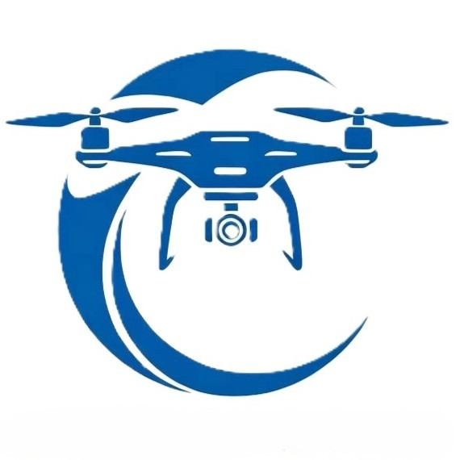

# 航鉴电力科技 (AeroInspect Tech) 官方网站



保定航鉴电力科技有限公司 (AeroInspect Tech) 是一家专注于新能源场站智能运维技术研发与落地的科技企业。本项目为公司的官方前端网站展示系统。

## 🌟 核心特性

- **现代响应式设计**: 采用 Tailwind CSS 构建，完美适配桌面端、平板与移动设备。
- **流畅的动画交互**: 基于 Motion (Framer Motion) 实现了顺滑的滚动侦测、淡入淡出及组件视差动画，增强品牌质感。
- **高可维护性**: 使用 React 18 与 TypeScript 进行组件化开发，确保代码的扩展性和类型安全。
- **现代化构建工具**: 使用 Vite 提供极速的本地开发体验与优化的生产环境构建产物。

## 🛠️ 技术栈

- **框架**: React 18, TypeScript
- **构建工具**: Vite
- **样式**: Tailwind CSS
- **动效**: Motion (Framer Motion)
- **图标**: Lucide React
- **组件库**: Ant Design (局部表单组件)

## 🚀 快速开始

### 1. 安装依赖

```bash
npm install
# 或
pnpm install
```

### 2. 启动开发服务器

```bash
npm run dev
# 或
pnpm dev
```
启动后在浏览器中访问 `http://localhost:3000` 即可预览项目。

### 3. 构建生产版本

```bash
npm run build
# 或
pnpm build
```

---

## 🖼️ 图片资源规范指引

为了确保网站上线后的视觉体验达到设计预期，请准备并替换 `public/images/` 目录下的占位图片。以下为需要的图片清单及格式规范：

### 1. 品牌与标识
- **路径**: `public/images/logo.jpg` (建议改为 `.png` 或 `.svg` 并修改引用)
- **尺寸**: 建议 `400 x 100` 像素左右 (比例约 4:1)
- **要求**: 包含图形与“保定航鉴电力科技有限公司”字样，背景透明，边缘清晰无锯齿。

### 2. 首页视觉图
- **首页头图 (Hero Banner)**
  - **路径**: `public/images/hero-bg.jpg`
  - **尺寸**: `1920 x 1080` 像素 (16:9)
  - **要求**: 高清实景拍摄图（建议为风电场航拍图），色调偏冷/深蓝，以确保其上方的白色文字具备极佳的对比度。
- **首页案例封面**
  - **路径**: `public/images/home-case.jpg`
  - **尺寸**: `800 x 600` 像素 (4:3)
  - **要求**: 乾安风电场实拍图或无人机挂载设备特写。
- **合作伙伴 Logo**
  - **路径**: `public/images/partner-1.png`, `partner-2.png`, `partner-3.png`
  - **尺寸**: 建议宽度控制在 `200~300` 像素以内
  - **要求**: 必须为透明背景的 PNG 格式。

### 3. 通用 Banner 图
- **产品服务页 Banner**: `public/images/products-banner-bg.jpg`
- **业务案例页 Banner**: `public/images/case-banner.jpg`
- **尺寸**: `1920 x 450` 像素 (超宽比例)
- **要求**: 高清大图，风力发电机、风电场阵列或科技感抽象图，画面中心避免过多细节以防干扰文字。

### 4. 业务板块与产品图
- **产品明细插图**
  - **路径**: `public/images/service-equipment-full.jpg`, `service-inspection-full.jpg`, `service-licensing-full.jpg`
  - **尺寸**: `800 x 600` 像素 (4:3)
  - **要求**: 分别对应硬件设备实拍、无人机巡检作业图、软件后台/算法处理界面。画面明亮，主体突出。
- **案例现场照片集**
  - **路径**: `public/images/case-photo-1.jpg` 至 `case-photo-4.jpg`
  - **尺寸**: `600 x 800` 像素 (3:4 竖图比例)
  - **要求**: 分别展示作业现场、设备特写、缺陷结果图、系统后台截图。风格统一。

### 5. 公司展示
- **公司大楼/团队图**
  - **路径**: `public/images/about-company.jpg`
  - **尺寸**: `800 x 600` 像素 (4:3) 或横版宽图
  - **要求**: 展示公司真实办公楼外观或核心研发团队合影，体现科技属性。

## 📄 开源协议 & 归属

本项目为保定航鉴电力科技有限公司商业项目。未经授权，禁止随意传播或用于其他商业用途。
